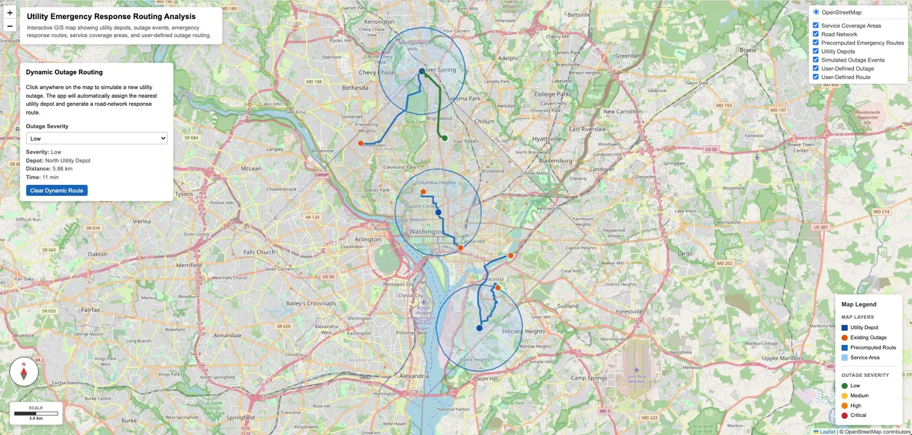
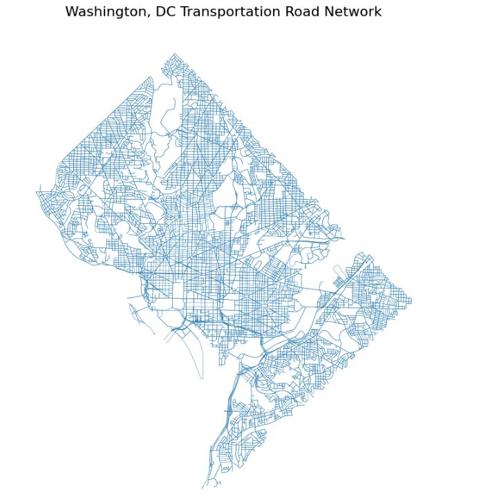
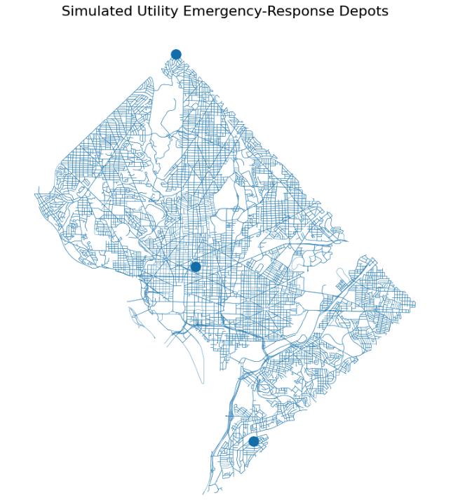
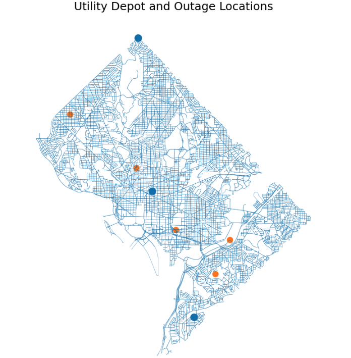
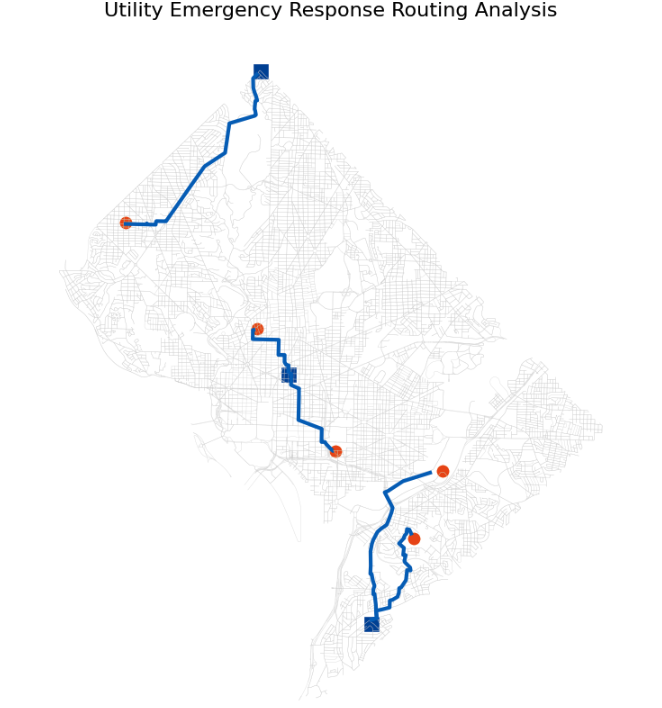
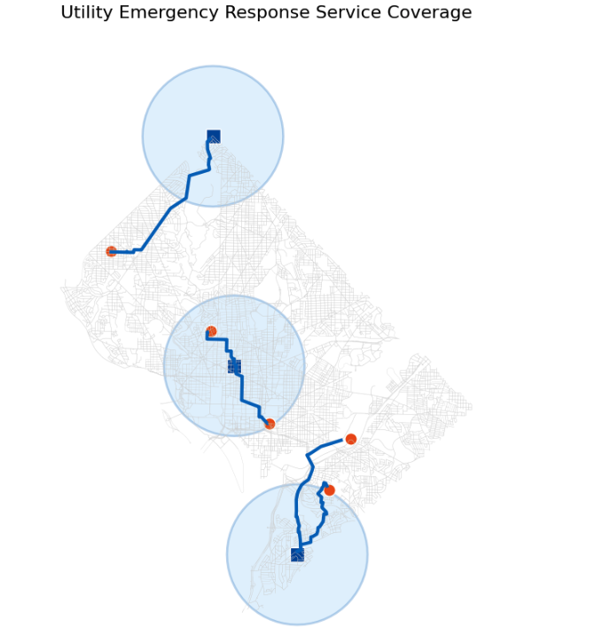
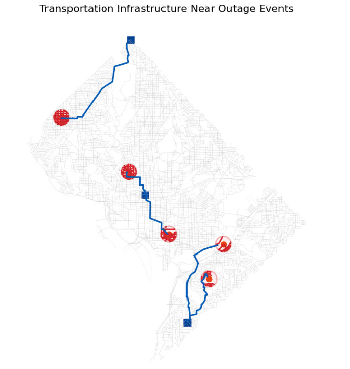

<h1>Utility Emergency Response Routing & Service Coverage Analysis</h1>

<h2>Operational GIS Network Analysis Using Open-Source Geospatial Tools</h2>

  

<h2>Live Interactive Web Map</h2>

This project includes a fully deployed interactive Leaflet web GIS application hosted through GitHub Pages.

<strong>Launch Live Web Map:</strong>

<a href="https://namozhdehi.github.io/utility-emergency-response-routing-analysis/" target="_blank">
https://namozhdehi.github.io/utility-emergency-response-routing-analysis/
</a>

The interactive application includes:

<ul>
  <li>Transportation road network visualization</li>
  <li>Utility depot locations</li>
  <li>Simulated outage events</li>
  <li>Emergency response routing</li>
  <li>Service coverage visualization</li>
  <li>Layer controls and operational GIS interface</li>
</ul>

  

<h2>Project Overview</h2>

Utility organizations need efficient ways to evaluate how emergency response crews can reach outage events, infrastructure failures, and service disruption locations across a transportation network.

This project simulates a utility emergency response workflow in Washington, DC using open-source geospatial tools, transportation-network analysis, spatial SQL, and interactive web GIS visualization.

The workflow models how utility crews may travel from operational depots to outage events using network-based routing analysis across the OpenStreetMap transportation network.

The project combines:

<ul>
  <li>Python-based GIS automation</li>
  <li>Transportation network analysis</li>
  <li>GeoPandas spatial processing</li>
  <li>Spatial SQL analytics</li>
  <li>DuckDB Spatial integration</li>
  <li>QGIS validation workflows</li>
  <li>Leaflet interactive web mapping</li>
</ul>

<h2>Operational Problem</h2>

<ul>
  <li>Which utility depot should respond to each outage?</li>
  <li>What is the shortest transportation-network route?</li>
  <li>Which outage events are outside approximate service coverage?</li>
  <li>Which road segments are near outage impact zones?</li>
  <li>Where are potential emergency response accessibility gaps?</li>
</ul>

<h2>Key Skills Demonstrated</h2>

<ul>
  <li>Transportation network acquisition with OSMnx</li>
  <li>Shortest-path routing with NetworkX</li>
  <li>GeoPandas vector spatial analysis</li>
  <li>CRS-aware spatial processing</li>
  <li>Infrastructure impact analysis</li>
  <li>Service coverage analysis</li>
  <li>DuckDB Spatial SQL querying</li>
  <li>QGIS cartographic production</li>
  <li>Leaflet web GIS deployment</li>
  <li>GitHub Pages deployment workflows</li>
</ul>

<h2>Technology Stack</h2>

<table>
  <tr>
    <th>Component</th>
    <th>Technology</th>
  </tr>

  <tr>
    <td>Desktop GIS</td>
    <td>QGIS</td>
  </tr>

  <tr>
    <td>Spatial Analysis</td>
    <td>Python, GeoPandas, Shapely</td>
  </tr>

  <tr>
    <td>Transportation Network</td>
    <td>OSMnx, OpenStreetMap</td>
  </tr>

  <tr>
    <td>Routing Engine</td>
    <td>NetworkX</td>
  </tr>

  <tr>
    <td>Spatial SQL</td>
    <td>DuckDB Spatial</td>
  </tr>

  <tr>
    <td>Spatial Storage</td>
    <td>GeoPackage</td>
  </tr>

  <tr>
    <td>Web GIS</td>
    <td>Leaflet, GeoJSON</td>
  </tr>

  <tr>
    <td>Notebook Environment</td>
    <td>JupyterLab</td>
  </tr>
</table>

<h2>Project Workflow</h2>

<pre>
OpenStreetMap Road Network
        ↓
OSMnx Network Acquisition
        ↓
NetworkX Shortest-Path Routing
        ↓
GeoPandas Spatial Processing
        ↓
Service Coverage Analysis
        ↓
Infrastructure Impact Analysis
        ↓
GeoPackage Spatial Storage
        ↓
DuckDB Spatial SQL Analytics
        ↓
QGIS Validation and Cartography
        ↓
GeoJSON Export
        ↓
Leaflet Interactive Web GIS
        ↓
GitHub Pages Deployment
</pre>

<h2>Project Structure</h2>

<pre>
utility-emergency-response-routing-analysis/
│
├── data/
│   ├── roads.geojson
│   ├── utility_depots.geojson
│   ├── utility_outages.geojson
│   ├── utility_service_areas.geojson
│   ├── emergency_response_routes.geojson
│   └── processed/
│
├── notebooks/
│   └── utility_emergency_routing_analysis.ipynb
│
├── outputs/
│   ├── final_operational_qgis_layout.png
│   ├── final_operational_qgis_layout.pdf
│   └── screenshots/
│
├── qgis/
│   └── utility_emergency_response_routing.qgz
│
├── docs/
│   ├── index.html
│   └── data/
│
├── index.html
├── requirements.txt
├── README.md
└── .gitignore
</pre>

<h2>Analysis Summary</h2>

<h3>Transportation Network</h3>

The Washington, DC drivable transportation network was downloaded from OpenStreetMap using OSMnx.

  

<h3>Utility Depot Locations</h3>

Simulated utility depots represent operational emergency response origins.

  

<h3>Outage Event Analysis</h3>

Simulated outage events represent emergency-response destinations across the transportation network.

  

<h3>Emergency Response Routing</h3>

NetworkX shortest-path routing calculates realistic transportation-network emergency routes.

  

<h3>Service Coverage Analysis</h3>

Approximate operational service areas are modeled around utility depots.

  

<h3>Infrastructure Impact Analysis</h3>

Spatial overlay analysis identifies transportation infrastructure near outage impact zones.

  

<h3>Final Operational Cartographic Layout</h3>

Final operational cartography was prepared in QGIS using layered transportation, routing, and service coverage visualization.

  

<h2>Interactive GIS Deployment</h2>

The final GeoJSON operational layers are deployed through a live Leaflet web GIS application hosted on GitHub Pages.

This deployment demonstrates:

<ul>
  <li>Web GIS deployment workflows</li>
  <li>Client-side spatial visualization</li>
  <li>Interactive operational mapping</li>
  <li>Layer management</li>
  <li>GeoJSON web integration</li>
</ul>

<h2>How to Run the Project</h2>

<h3>1. Clone Repository</h3>

<pre>
git clone git@github.com:namozhdehi/utility-emergency-response-routing-analysis.git
cd utility-emergency-response-routing-analysis
</pre>

<h3>2. Create Virtual Environment</h3>

<pre>
python3 -m venv .venv
source .venv/bin/activate
</pre>

<h3>3. Install Dependencies</h3>

<pre>
pip install -r requirements.txt
</pre>

<h3>4. Launch JupyterLab</h3>

<pre>
jupyter lab
</pre>

<h3>5. Launch Local Web Map</h3>

<pre>
python3 -m http.server 8000
</pre>

<h2>Author</h2>

<strong>Nahid Mozhdehi</strong>

GIS and geospatial engineering portfolio project focused on transportation-network analysis, emergency routing workflows, spatial SQL, and interactive web GIS visualization.

